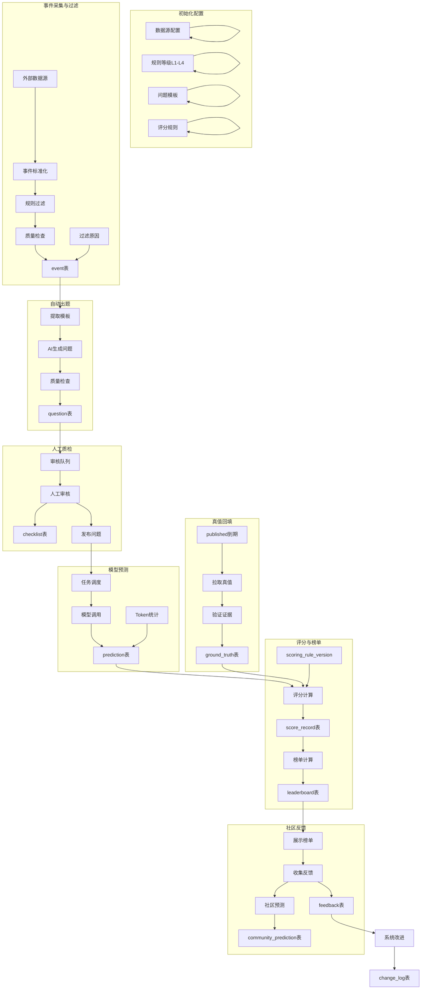

# MOPPA 系统数据库设计与流程详细说明文档

## 目录
1. [系统概述](#1-系统概述)
2. [数据表使用说明](#2-数据表使用说明)
3. [完整业务流程详解](#3-完整业务流程详解)
4. [各阶段详细操作指南](#4-各阶段详细操作指南)
5. [关键查询示例](#5-关键查询示例)
6. [数据流转图](#6-数据流转图)

---

## 1. 系统概述

MOPPA（Model Prediction Performance Assessment）是一个完整的模型评测系统，通过真实事件驱动，自动生成问题、收集预测、比对真值、计算评分，最终输出模型能力榜单。

### 1.1 核心流程
```
事件获取 → 出题 → 预测 → 真值回填 → 评分 → 榜单发布 → 社区反馈
```

### 1.2 核心实体关系
- **事件**（Event）：原始事件数据，问题的产生根源
- **问题**（Question）：基于事件生成的待预测问题
- **预测**（Prediction）：模型对问题的预测答案
- **真值**（Ground Truth）：问题的真实答案
- **评分**（Score Record）：基于预测和真值计算出的评分

---

## 2. 数据表使用说明

### 2.1 基础信息表

#### 2.1.1 用户表（user）
**用途**：存储系统所有用户信息，实现SOP定义的5类角色体系。

**关键字段**：
- `role`：用户角色，可选值：
  - `intelligence_expert`：情报专家，负责模板确认、质量抽检
  - `algorithm_engineer`：算法工程师，负责事件过滤、自动出题、评分策略
  - `platform_engineer`：平台工程师，负责调度、存储、运维
  - `operator`/`auditor`：运营/审核，负责人工筛题、评论治理
  - `data_analyst`：数据分析，负责指标看板和报表

**使用场景**：
- 系统登录认证
- 权限控制（RBAC）
- 审计追踪（记录操作人）
- 任务分配（如审核任务分配）

#### 2.1.2 模型表（model）
**用途**：存储参与评测的所有AI模型信息。

**关键字段**：
- `identifier`：模型唯一标识，如"openai-gpt4"
- `version`：模型版本，支持多版本并行评测
- `performance_metrics`：JSON格式，存储历史性能指标
- `credibility_level`：模型可信度评级

**使用场景**：
- S4阶段模型调用配置
- 模型性能对比分析
- 模型权限管理（哪些模型可以参与哪类问题）

---

### 2.2 配置管理表（S0阶段）

#### 2.2.1 数据源配置表（data_source）
**用途**：管理外部数据源接入，S0初始化阶段的核心配置。

**关键字段**：
- `source_system`：来源系统标识，用于event表的source_system字段
- `credibility_level`：数据源可信度（1-5），影响事件的可信度
- `connection_config`：加密存储的连接配置

**使用场景**：
- S1阶段事件采集
- 数据源管理界面
- 数据质量评估

#### 2.2.2 提取数据源配置表（extraction_config）
**用途**：配置数据提取策略，支持增量、全量、流式提取。

**使用场景**：
- 调度系统配置数据抽取任务
- 配置重试策略
- 监控数据同步状态

#### 2.2.3 规则等级配置表（rule_level_config）
**用途**：定义L1-L4四个等级的具体属性。

**关键字段**：
- `level`：1-4，对应L1-L4
- `weight`：等级权重，影响评分计算
- `level_name`：等级显示名称

**使用场景**：
- 问题分级管理
- 评分权重计算
- 分榜单生成

#### 2.2.4 事件过滤规则表（event_filter_rule）
**用途**：配置S1阶段的事件过滤规则。

**关键字段**：
- `filter_expression`：过滤表达式（SQL或类SQL语法）
- `level`：规则适用的等级
- `pass_rate_threshold`：通过率阈值，低于此值需人工审核

**使用场景**：
- 事件自动过滤
- 过滤原因记录
- 规则效果监控

---

### 2.3 问题模板与规则表

#### 2.3.1 问题模板表（question_template）
**用途**：S2阶段自动出题的核心模板配置。

**关键字段**：
- `template_content`：支持变量替换的模板文本
- `variables`：JSON定义所需的变量和格式
- `generation_config`：生成参数（答案空间提示、难度控制等）
- `verification_conditions`：可验证条件定义
- `duplicate_check_window`：防重复检查窗口期

**使用场景**：
- AI自动生成问题
- 问题质量保证
- 重复率控制

#### 2.3.2 评分规则版本表（scoring_rule_version）
**用途**：S6阶段评分规则版本管理。

**关键字段**：
- `dimensions`：评分维度定义，如：
  ```json
  {
    "accuracy": {"weight": 0.6, "max_score": 60},
    "timeliness": {"weight": 0.2, "max_score": 20},
    "confidence": {"weight": 0.2, "max_score": 20}
  }
  ```
- `calculation_formula`：评分公式说明

**使用场景**：
- 评分规则版本控制
- 评分可复现
- 规则变更追踪

---

### 2.4 核心业务表

#### 2.4.1 事件表（event）
**用途**：存储S1阶段采集并过滤后的事件。

**关键字段**：
- `trace_id`：全流程链路追踪ID
- `credibility_level`：继承自数据源的可信度
- `filter_status`：过滤状态（passed/filtered）
- `filter_reasons`：过滤原因标签数组

**使用场景**：
- S2阶段问题生成的基础数据
- 事件统计分析
- 过滤效果监控

#### 2.4.2 问题表（question）
**用途**：存储S2阶段生成、S3阶段审核后发布的问题。

**关键字段**：
- `deadline`：截止时间，过期状态变为expired
- `verification_conditions`：从模板继承的可验证条件
- `status`：问题生命周期状态
- `duplicate_check_hash`：用于防重复检测的哈希值

**使用场景**：
- S4阶段模型预测的输入
- 问题质量控制
- 到期问题自动关闭

#### 2.4.3 审核清单表（checklist）
**用途**：S3阶段人工质检记录，确保问题质量。

**关键字段**：
- `review_type`：审核类型（初检/抽检/双人复核）
- `decision`：审核结论（通过/驳回/修改）
- `reason_tags`：驳回原因标签
- `is_verifiable`：可验证条件是否明确
- `is_trust_evidence`：证据来源是否可信

**使用场景**：
- 质量控制流程
- 审核一致性统计
- 驳回原因分析

#### 2.4.4 预测表（prediction）
**用途**：存储S4阶段各模型的预测结果。

**关键字段**：
- `confidence`：模型预测的置信度（0-100）
- `inference_time_ms`：模型推理耗时
- `token_usage`：Token使用统计
- `task_execution_id`：关联任务执行记录

**使用场景**：
- S5阶段真值对比
- S6阶段评分计算
- 模型性能分析

#### 2.4.5 真实答案表（ground_truth）
**用途**：存储S5阶段从外部系统获取的真值数据。

**关键字段**：
- `evidence_links`：证据链接数组，支持验证
- `publish_time`：真值发布时间
- `credibility_level`：真值可信度评级
- `verified_by`：真值验证人

**使用场景**：
- S6阶段评分标准
- 真值覆盖率统计
- 延迟回填监控

#### 2.4.6 评分记录表（score_record）
**用途**：存储S6阶段计算的详细评分。

**关键字段**：
- `dimension_scores`：各维度得分详情
- `scoring_method`：评分方式（rule/ai/hybrid）
- `weight_config`：评分时的权重配置快照
- `is_reproducible`：标记是否可复现

**使用场景**：
- 榜单生成基础数据
- 评分质量分析
- 模型能力画像

---

### 2.5 社区反馈表（S7阶段）

#### 2.5.1 反馈表（feedback）
**用途**：存储S7阶段的用户反馈和社区意见。

**关键字段**：
- `target_type`：反馈对象类型（question/prediction/score/leaderboard）
- `priority`：处理优先级
- `assigned_to`：处理责任人
- `resolution`：解决方案

**使用场景**：
- 社区治理
- 系统改进收集
- 反馈闭环追踪

#### 2.5.2 人工预测表（community_prediction）
**用途**：存储社区用户的人工预测，用于对比和教学。

**使用场景**：
- 社区竞赛
- 模型性能基准
- 用户能力评估

---

### 2.6 系统管理表

#### 2.6.1 变更管理表（change_log）
**用途**：记录所有重要系统变更，确保可追溯。

**关键字段**：
- `change_id`：变更唯一ID，用于关联所有相关变更
- `grey_scale_percentage`：灰度发布比例
- `observation_window`：观察窗口期
- `rollback_time`：回滚时间

**使用场景**：
- 变更审计
- 紧急回滚
- 影响分析

#### 2.6.2 任务执行表（task_execution）
**用途**：记录所有调度任务执行情况。

**关键字段**：
- `idempotency_key`：幂等键，确保不重复执行
- `attempt_count`：重试次数
- `retry_intervals`：重试间隔配置
- `next_retry_at`：下次重试时间

**使用场景**：
- 任务监控
- 异常恢复
- 性能分析

---

## 3. 完整业务流程详解

### 3.1 数据流转总览



### 3.2 详细流程说明

#### 阶段S0：初始化与配置
1. **配置数据源**
   - 操作：`INSERT INTO data_source`
   - 关键字段：`source_system`, `credibility_level`, `connection_config`
   - 验证：连通性测试

2. **配置规则等级**
   - 操作：`INSERT INTO rule_level_config`
   - 关键字段：`level`, `weight`, `level_name`
   - 注意：L1-L4必须完整配置

3. **配置问题模板**
   - 操作：`INSERT INTO question_template`
   - 关键字段：`template_content`, `verification_conditions`
   - 审批：需要情报专家审批

4. **配置评分规则**
   - 操作：`INSERT INTO scoring_rule_version`
   - 关键字段：`dimensions`, `calculation_formula`
   - 版本控制：每次修改创建新版本

#### 阶段S1：事件采集与过滤
1. **事件标准化**
   ```sql
   INSERT INTO event (
       content, source_system, credibility_level,
       event_time, trace_id
   ) VALUES (...);
   ```

2. **规则过滤**
   - 查询过滤规则：`SELECT * FROM event_filter_rule WHERE is_active = true`
   - 应用规则：更新`filter_status`和`filter_reasons`

3. **质量检查**
   - 检查字段：`content`非空、`event_time`有效
   - 统计指标：过滤率、有效事件率

#### 阶段S2：自动出题
1. **提取模板**
   ```sql
   SELECT qt.* FROM question_template qt
   WHERE qt.level = e.level AND qt.status = 'active'
   ```

2. **AI生成问题**
   - 调用AI接口，使用`template_content`
   - 生成验证：检查`duplicate_check_hash`

3. **问题入库**
   ```sql
   INSERT INTO question (
       event_id, template_id, level, content,
       deadline, trace_id
   ) VALUES (...);
   ```

#### 阶段S3：人工质检
1. **审核队列**
   - 查询：`SELECT * FROM question WHERE status = 'pending_review'`

2. **执行审核**
   ```sql
   INSERT INTO checklist (
       question_id, reviewer_id, decision,
       is_verifiable, is_trust_evidence
   ) VALUES (...);
   ```

3. **状态更新**
   - 通过：`UPDATE question SET status = 'published'`
   - 驳回：记录原因标签

#### 阶段S4：模型预测
1. **任务调度**
   ```sql
   INSERT INTO task_execution (
       task_type, idempotency_key, trace_id
   ) VALUES (...);
   ```

2. **模型调用**
   - 查询可用模型：`SELECT * FROM model WHERE is_available = true`
   - 调用API，记录指标

3. **存储预测**
   ```sql
   INSERT INTO prediction (
       question_id, model_id, prediction_content,
       confidence, inference_time_ms, trace_id
   ) VALUES (...);
   ```

#### 阶段S5：真值回填
1. **查找到期问题**
   ```sql
   SELECT * FROM question
   WHERE deadline < NOW() AND status = 'published'
   ```

2. **拉取真值**
   - 从外部系统获取
   - 验证证据链

3. **存储真值**
   ```sql
   INSERT INTO ground_truth (
       question_id, answer, evidence_links,
       credibility_level, trace_id
   ) VALUES (...);
   ```

#### 阶段S6：评分与榜单
1. **评分计算**
   - 查询数据：关联`prediction`和`ground_truth`
   - 应用规则：使用`scoring_rule_version`
   - 存储结果：

2. **榜单生成**
   - 分维度统计：`SELECT level, model_id, AVG(total_score)`
   - 生成排名：按总分排序
   - 快照存储：

#### 阶段S7：社区反馈
1. **展示榜单**
   - 查询：`SELECT * FROM leaderboard WHERE is_published = true`

2. **收集反馈**
   ```sql
   INSERT INTO feedback (
       type, target_type, target_id,
       user_id, content, trace_id
   ) VALUES (...);
   ```

3. **处理闭环**
   - 分配处理人
   - 记录解决方案
   - 生成改进项

---

## 4. 各阶段详细操作指南

### 4.1 S1阶段操作指南

**目标**：达到95%有效事件入库率

#### 关键SQL操作：

1. **批量导入事件**
```sql
INSERT INTO event (
    event_key, content, source_system, credibility_level,
    event_time, tags, trace_id
) SELECT
    generate_event_key(data) as event_key,
    extract_content(data) as content,
    source_system,
    data_source.credibility_level,
    event_time,
    extract_tags(data) as tags,
    uuid_generate_v4() as trace_id
FROM staging_event_data
WHERE NOT EXISTS (
    SELECT 1 FROM event
    WHERE event.event_key = staging_event_data.event_key
);
```

2. **应用过滤规则**
```sql
UPDATE event e
SET filter_status = CASE
    WHEN EXISTS (
        SELECT 1 FROM event_filter_rule efr
        WHERE efr.level <= e.credibility_level
        AND efr.is_active = true
        AND matches_filter(e.content, efr.filter_expression)
    ) THEN 'passed'
    ELSE 'filtered'
END,
filter_reasons = CASE
    WHEN NOT EXISTS(...) THEN ARRAY['low_credibility']
    ELSE filter_reasons
END
WHERE e.filter_status = 'pending';
```

3. **质量检查统计**
```sql
SELECT
    source_system,
    COUNT(*) as total_events,
    COUNT(CASE WHEN filter_status = 'passed' THEN 1 END) as passed_events,
    COUNT(CASE WHEN filter_status = 'filtered' THEN 1 END) as filtered_events,
    ROUND(
        COUNT(CASE WHEN filter_status = 'passed' THEN 1 END) * 100.0 /
        NULLIF(COUNT(*), 0),
        2
    ) as pass_rate
FROM event
WHERE DATE(created_at) = CURRENT_DATE
GROUP BY source_system;
```

### 4.2 S2-S3阶段操作指南

**目标**：重复率<=5%，不可判定题<=3%

#### 生成问题示例：
```sql
WITH event_templates AS (
    SELECT
        e.id as event_id,
        e.content as event_content,
        qt.id as template_id,
        qt.template_content,
        qt.verification_conditions,
        e.trace_id
    FROM event e
    JOIN question_template qt ON qt.level = e.level
    WHERE e.filter_status = 'passed'
    AND NOT EXISTS (
        SELECT 1 FROM question q
        WHERE q.event_id = e.id
        AND q.level = qt.level
    )
    AND qt.status = 'active'
),
generated_questions AS (
    SELECT
        et.event_id,
        et.template_id,
        generate_question(et.template_content, et.event_content) as question_content,
        et.verification_conditions,
        calculate_deadline(NOW()) as deadline,
        et.trace_id
    FROM event_templates et
)
INSERT INTO question (
    event_id, template_id, level, content,
    deadline, verification_conditions,
    duplicate_check_hash, trace_id
)
SELECT
    gq.event_id,
    gq.template_id,
    qt.level,
    gq.question_content,
    gq.deadline,
    gq.verification_conditions,
    md5(gq.question_content || '|' || qt.level) as duplicate_check_hash,
    gq.trace_id
FROM generated_questions gq
JOIN question_template qt ON qt.id = gq.template_id
WHERE NOT EXISTS (
    SELECT 1 FROM question q
    WHERE q.duplicate_check_hash = md5(gq.question_content || '|' || qt.level)
    AND q.created_at > NOW() - INTERVAL '7 days'
);
```

### 4.4 S4阶段操作指南

**目标**：模型执行成功率>=98%，30分钟SLA

#### 任务幂等控制：
```sql
-- 检查是否已执行
SELECT * FROM task_execution
WHERE idempotency_key = CONCAT(
    'model_predict', '|',
    q.id, '|',
    DATE_TRUNC('day', NOW()), '|',
    m.id
)
AND status = 'completed';

-- 创建任务执行记录
INSERT INTO task_execution (
    task_type, business_id, model_id,
    idempotency_key, status, trace_id
) VALUES (
    'model_predict',
    q.id,
    m.id,
    CONCAT('model_predict', '|', q.id, '|', DATE_TRUNC('day', NOW()), '|', m.id),
    'pending',
    uuid_generate_v4()
);
```

### 4.6 S6阶段操作指南

#### 评分计算示例：
```sql
WITH predictions_with_truth AS (
    SELECT
        p.id as prediction_id,
        p.question_id,
        p.model_id,
        p.confidence,
        gt.id as ground_truth_id,
        gt.answer as ground_truth_answer,
        p.prediction_content,
        q.level
    FROM prediction p
    JOIN ground_truth gt ON gt.question_id = p.question_id
    JOIN question q ON q.id = p.question_id
    LEFT JOIN score_record sr ON sr.prediction_id = p.id
    WHERE sr.id IS NULL  -- 未评分的
),
score_calculation AS (
    SELECT
        pwt.*,
        -- 准确性得分
        CASE
            WHEN pwt.prediction_content = pwt.ground_truth_answer THEN 60
            ELSE similarity(pwt.prediction_content, pwt.ground_truth_answer) * 60
        END as accuracy_score,
        -- 时效性得分（基于预测时间）
        CASE
            WHEN pwt.prediction_time <= pwt.ground_truth_time - INTERVAL '24 hours' THEN 20
            WHEN pwt.prediction_time <= pwt.ground_truth_time - INTERVAL '12 hours' THEN 15
            WHEN pwt.prediction_time <= pwt.ground_truth_time THEN 10
            ELSE 5
        END as timeliness_score,
        -- 置信度得分
        pwt.confidence * 0.2 as confidence_score
    FROM predictions_with_truth pwt
    JOIN prediction p ON p.id = pwt.prediction_id
    JOIN ground_truth gt ON gt.id = pwt.ground_truth_id
)
INSERT INTO score_record (
    prediction_id, ground_truth_id, scoring_rule_version,
    dimension_scores, total_score, scoring_method,
    weight_config, trace_id
)
SELECT
    sc.prediction_id,
    sc.ground_truth_id,
    'score.v1',  -- 当前活跃版本
    json_build_object(
        'accuracy', sc.accuracy_score,
        'timeliness', sc.timeliness_score,
        'confidence', sc.confidence_score
    ) as dimension_scores,
    sc.accuracy_score + sc.timeliness_score + sc.confidence_score as total_score,
    'rule' as scoring_method,
    (SELECT dimensions FROM scoring_rule_version WHERE version = 'score.v1') as weight_config,
    uuid_generate_v4() as trace_id
FROM score_calculation sc;
```

---

## 5. 关键查询示例

### 5.1 流程监控查询

**监控全流程转化率**：
```sql
WITH stage_stats AS (
    -- S1阶段
    SELECT
        'S1_Event_Ingestion' as stage,
        COUNT(*) as count,
        COUNT(CASE WHEN filter_status = 'passed' THEN 1 END) as success
    FROM event
    WHERE DATE(created_at) = CURRENT_DATE

    UNION ALL

    -- S2阶段
    SELECT
        'S2_Question_Generation' as stage,
        COUNT(*) as count,
        COUNT(CASE WHEN status IN ('pending_review', 'published') THEN 1 END) as success
    FROM question
    WHERE DATE(created_at) = CURRENT_DATE

    UNION ALL

    -- S3阶段
    SELECT
        'S3_Quality_Review' as stage,
        COUNT(*) as count,
        COUNT(CASE WHEN status = 'published' THEN 1 END) as success
    FROM question
    WHERE DATE(updated_at) = CURRENT_DATE

    UNION ALL

    -- S4阶段
    SELECT
        'S4_Model_Prediction' as stage,
        COUNT(DISTINCT te.id) as count,
        COUNT(DISTINCT CASE WHEN te.status = 'completed' THEN te.id END) as success
    FROM task_execution te
    WHERE te.task_type = 'model_predict'
    AND DATE(te.created_at) = CURRENT_DATE

    UNION ALL

    -- S5阶段
    SELECT
        'S5_Truth_Gathering' as stage,
        COUNT(DISTINCT q.id) as count,
        COUNT(DISTINCT gt.question_id) as success
    FROM question q
    LEFT JOIN ground_truth gt ON gt.question_id = q.id
    WHERE q.deadline < NOW() - INTERVAL '24 hours'
    AND DATE(q.deadline) = CURRENT_DATE - INTERVAL '1 day'

    UNION ALL

    -- S6阶段
    SELECT
        'S6_Scoring' as stage,
        COUNT(*) as count,
        COUNT(*) as success
    FROM score_record
    WHERE DATE(created_at) = CURRENT_DATE
)
SELECT
    stage,
    count,
    success,
    ROUND(success * 100.0 / NULLIF(count, 0), 2) as success_rate
FROM stage_stats
ORDER BY stage;
```

### 5.2 模型性能分析

**模型多维度性能对比**：
```sql
SELECT
    m.name as model_name,
    ql.level_name as question_level,
    COUNT(p.id) as total_predictions,
    AVG(p.confidence) as avg_confidence,
    AVG(p.inference_time_ms) as avg_inference_time,
    AVG(sr.total_score) as avg_score,
    COUNT(CASE WHEN sr.total_score >= 80 THEN 1 END) * 100.0 / COUNT(*) as excellent_rate,
    -- 标准差，评估稳定性
    STDDEV(sr.total_score) as score_stddev
FROM model m
JOIN prediction p ON p.model_id = m.id
JOIN score_record sr ON sr.prediction_id = p.id
JOIN question q ON q.id = p.question_id
JOIN rule_level_config ql ON ql.level = q.level
WHERE DATE(p.submission_time) >= CURRENT_DATE - INTERVAL '30 days'
GROUP BY m.name, ql.level_name
ORDER BY model_name, ql.level;
```

### 5.3 异常检测查询

**检测异常模式**：
```sql
-- 1. 模型预测异常
SELECT
    m.name,
    DATE(p.submission_time) as date,
    COUNT(*) as predictions,
    COUNT(CASE WHEN p.status = 'failed' THEN 1 END) as failures,
    AVG(p.inference_time_ms) as avg_time
FROM model m
JOIN prediction p ON p.model_id = m.id
WHERE p.submission_time >= CURRENT_DATE - INTERVAL '7 days'
GROUP BY m.name, DATE(p.submission_time)
HAVING COUNT(CASE WHEN p.status = 'failed' THEN 1 END) > 0
OR AVG(p.inference_time_ms) > (
    SELECT AVG(inference_time_ms) * 2
    FROM prediction
    WHERE submission_time >= CURRENT_DATE - INTERVAL '30 days'
);

-- 2. 质量异常
SELECT
    DATE(created_at) as date,
    COUNT(*) as questions,
    COUNT(CASE WHEN status = 'reject' THEN 1 END) as rejects,
    COUNT(CASE WHEN duplicate_check_hash IN (
        SELECT duplicate_check_hash
        FROM question
        WHERE created_at > CURRENT_DATE - INTERVAL '7 days'
        GROUP BY duplicate_check_hash
        HAVING COUNT(*) > 1
    ) THEN 1 END) as duplicates
FROM question
WHERE created_at >= CURRENT_DATE - INTERVAL '7 days'
GROUP BY DATE(created_at)
HAVING COUNT(CASE WHEN status = 'reject' THEN 1 END) * 100.0 / COUNT(*) > 10
OR COUNT(CASE WHEN duplicate_check_hash IN (...) THEN 1 END) * 100.0 / COUNT(*) > 5;
```

---

## 6. 数据流转图

### 6.1 实时数据流

```
外部事件源 → event_filter_rule → event_table
                     ↓
question_template → AI出题 → question_table
                     ↓
人工审核(checklist) → published_questions
                     ↓
task_execution → model调用 → prediction_table
                     ↓
到期扫描 → ground_truth_table
                     ↓
scoring_rule → score_record
                     ↓
weekly_job → leaderboard
                     ↓
frontend展示 → feedback → system_improvement
```

### 6.2 批处理数据流

```
每日2点主任务：
1. 扫描新增事件 → 应用过滤规则 → 标记过滤状态
2. 为通过事件 → 生成问题 → 进入审核队列
3. 调度模型预测 → 批量调用 → 记录结果
4. 计算评分 → 更新榜单 → 发送通知

每小时补偿任务：
1. 检查失败任务 → 指数退避重试
2. 更新指标 → 检查阈值 → 发送告警
3. 同步配置 → 应用变更 → 记录日志
```

---

## 总结

本文档详细说明了MOPPA系统数据库的设计理念和实际应用：

1. **完整的流程覆盖**：从S0到S7，每个阶段都有对应的数据表支持
2. **严格的质量控制**：通过多道检查确保数据质量
3. **灵活的配置管理**：支持版本控制和灰度发布
4. **全面的监控体系**：实时监控各阶段指标
5. **可靠的执行保障**：幂等性、重试、死信队列机制
6. **开放的反馈机制**：支持社区参与和持续改进

通过合理的表结构和索引设计，系统可以高效处理大规模数据，同时保证数据的准确性和可追溯性。